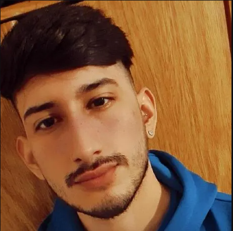
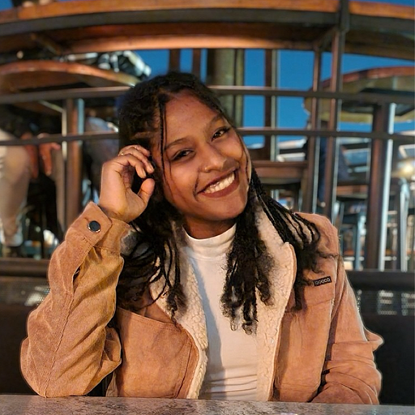
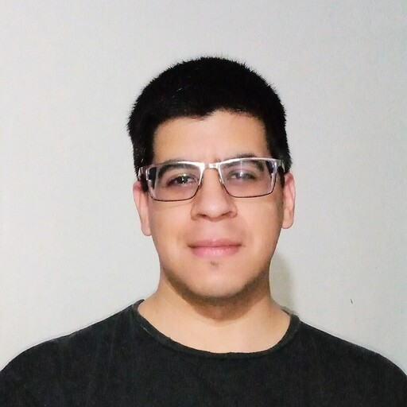

# h2-03-csharp-react
Propuesta de aplicación de SportsTech para WAKI, dentro del marco del Hackathon de No Country.

 Web de desarrollo: https://h2-03-csharp-react.onrender.com/

## Badges

## Equipo de desarrollo H2-03-CSharp-React

## Team Lider

### - _Diego González_

## Diseño UI/UX

#### - _Joaquín Peña_

#### - _Lady Espinoza_

## Frontend

#### - _Wilsconidel Yanez_

#### - _Nicolás Enciso_

## Backend

#### - _Julián Torres_

#### - _Rodrigo Kohnen_

## QA

#### - _Arnoldo Felce_

## Project Manager

#### - _Damian Berrojalvis_

